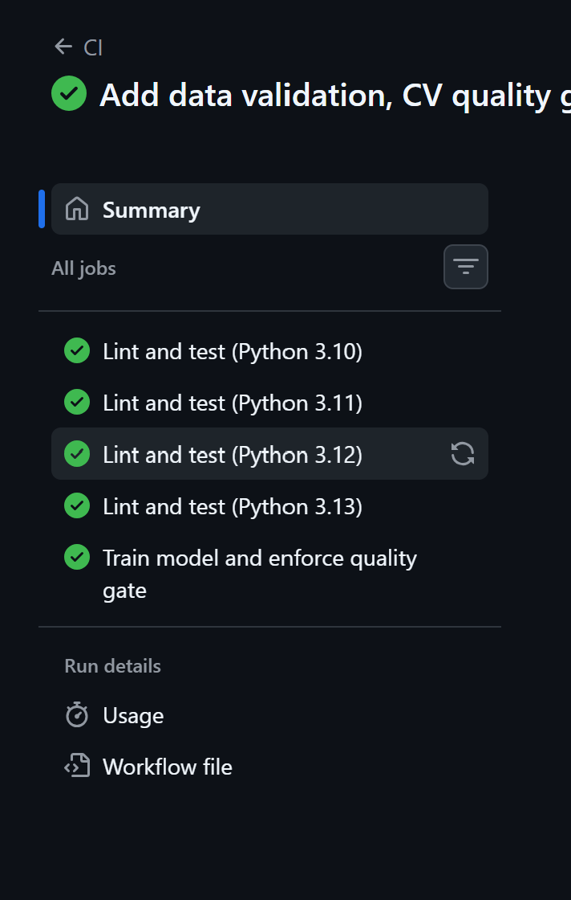
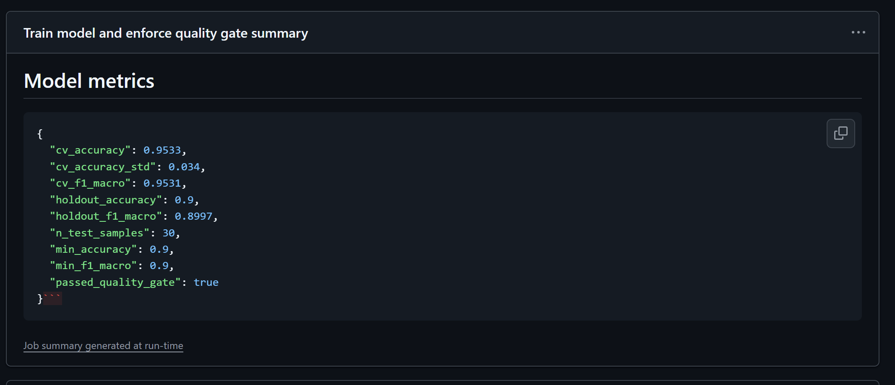
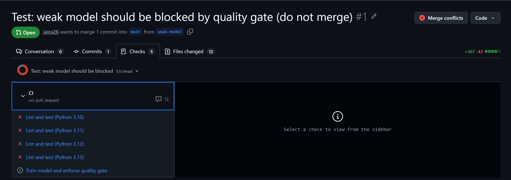
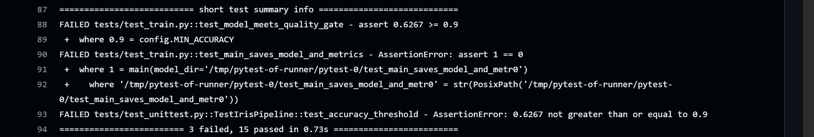
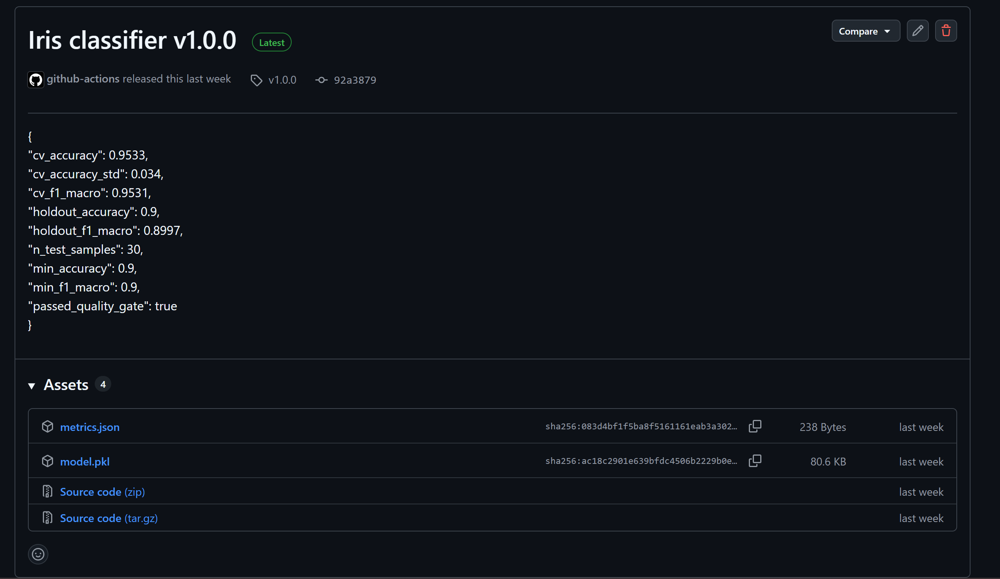

# MLOps Lab 1: CI/CD Pipeline for an ML Model with GitHub Actions


Modified version of [Lab 1 (Github_Labs)](https://github.com/raminmohammadi/MLOps/tree/main/Labs/Github_Labs/Lab1) from the Northeastern MLOps course.

## What I changed from the original lab

| Original lab | This version |
|---|---|
| `calculator.py` with four arithmetic functions | ML pipeline on the Iris dataset: data loading, schema validation, training, evaluation |
| Tests check arithmetic results | Tests check the data schema, rejection of bad data, model quality, determinism, train/test leakage, and saved artifacts |
| Two workflows running tests on Python 3.8 | One CI workflow: ruff linting, pytest with coverage, unittest, on a Python 3.10 to 3.13 matrix |
| No model | CI trains a Random Forest and enforces a **quality gate**: 5-fold cross-validated accuracy and macro-F1 must be at least 0.90, otherwise the build fails and the model is not saved |
| `actions/*@v2` (deprecated) | `checkout@v4`, `setup-python@v5`, `upload-artifact@v4`, pip caching |
| No deployment | **CD:** pushing a `v*` tag re-tests, retrains, re-checks the gate, and publishes the model as a GitHub Release |
| - | Weekly scheduled run, metrics published to the Actions job summary, model uploaded as a build artifact |

## Pipeline

```
push / pull request to main
   -> test (Python 3.10, 3.11, 3.12, 3.13 in parallel): ruff -> pytest + coverage -> unittest
   -> train (only if every test job passes): validate data -> cross-validate -> quality gate -> save model artifact

push a tag such as v1.0.0
   -> release: pytest -> train -> quality gate -> GitHub Release with model.pkl and metrics.json
```

## Why the quality gate uses cross-validation

A single 30-row test split is noisy: each misclassified flower moves accuracy by 3.3 points. On this dataset, one fixed split scored exactly 0.90, while individual cross-validation folds ranged from 0.90 to 1.00. Gating on the 5-fold mean (0.95) gives a stable pass/fail decision instead of one that depends on which rows land in the test set.

## Project structure

```
src/
  config.py     hyperparameters, quality-gate thresholds, output paths
  data.py       load_data(), validate_data()
  train.py      split, build, cross-validate, evaluate, gate, save
tests/
  conftest.py       shared pytest fixtures
  test_data.py      data validation tests (pytest)
  test_train.py     model and pipeline tests (pytest)
  test_unittest.py  pipeline tests (unittest)
.github/workflows/
  ci.yml   continuous integration and training
  cd.yml   continuous delivery: model release on tag
```

## Run locally

```bash
python -m venv .venv
.venv\Scripts\Activate.ps1        # Mac/Linux: source .venv/bin/activate
pip install -r requirements.txt

ruff check .
pytest --cov=src
python -m unittest discover -s tests -t . -p "test_unittest.py"
python -m src.train               # writes models/model.pkl and models/metrics.json
```

## Demonstrating the quality gate

Setting `N_ESTIMATORS = 1` and `MAX_DEPTH = 1` in `src/config.py` drops cross-validated accuracy to about 0.63. The tests fail, the train job is skipped, and the pull request is blocked. See the Evidence section below.

## Evidence

**CI passing on main** (4 Python versions, then training)



**Model metrics published in the job summary**



**Quality gate blocking a weak model** (`N_ESTIMATORS = 1`, `MAX_DEPTH = 1`): all test jobs fail on the accuracy check, and the train job is skipped





**CD: model published as a GitHub Release** (`v1.0.0`, built from the tested commit)

